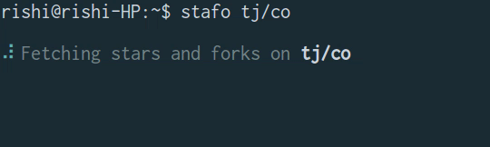

# 

> Command line tool find total stars and forks across a github repository

<h1 align="center">
<br>

<br>
<a "https://travis-ci.org/CodeDotJS/gictivity-cli">

</a>
</h1> 

## Install

- `Ensure you've node.js version >=4 installed. Then run the following :`

```sh
$ npm install --global stafo-cli
```
__`OR`__
```sh
$ sudo npm install --global stafo-cli
```

## Usage

```
Usage   : stafo <username/repository>

Example : stafo CodeDotJS/kote   [user]
          stafo facebook/reactjs [organization]
```

## Related

- [stafo](https://github.com/CodeDotJS/stafo) : API for this tool

- [gictivity](https://github.com/CodeDotJS/gictivity-cli) : CLI Too to track activities of a github user.

## License

MIT &copy; [Rishi Giri](http://rishigiri.com)
